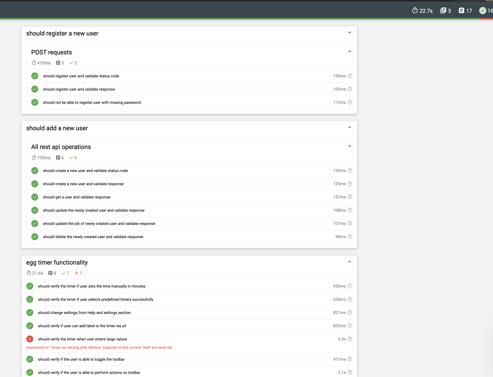

# qa-assignment-contentoo
This repository contains the code for UI and API test automation and manual test documentation

1) software_testing_theory_task.pdf
2) bugs_namra.pdf
3) manual_testing_namra.pdf
4) test_plan_namra.xlsx
5) List of improvement points in this framework

* WebUrl: https://e.ggtimer.com/
* BaseUrl: https://reqres.in/

### Framework Description
This automation framework is developed using Cypress and Javascript for UI and API testing.

### Framework Features

* Page Object Model design pattern
* Screenshots and video recording for tests
* Generate combined reports for all test execution results

### Installation

* Install Node.js
* Clone the repo: https://github.com/namra19/qa-assignment-contentoo.git
* Install NPM Packages: $ npm install

### Running Tests

* Run Tests on Cypress Test Runner: npm run script-open
* RunTests in headless mode: npm test

* To view reports - Go to cypress/reports/mochareports/report.html
Right click on report.html file and copy path to view in browser

### Framework Tools and Languages

* Cypress 12.1.0
* Javascript 
* Node v16.16.0
* Visual Studio Code 
* Mochawesome Report 6.2.0

### Project Structure

* Fixtures - Has sub folders as per the pages to store urls and constants
* Integration - Has test cases for both UI and API
* Page Objects - Contains all the locators for test cases as per the pages

